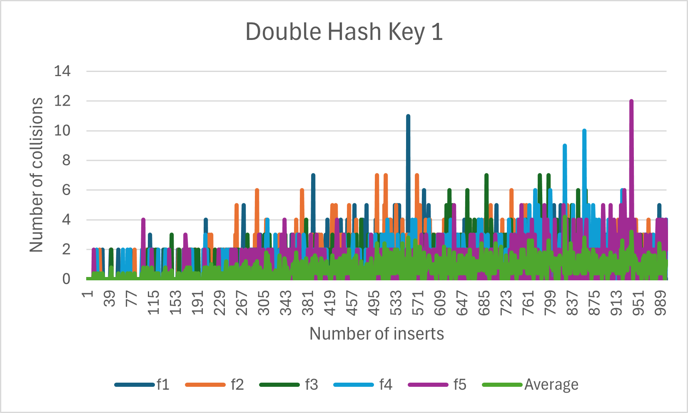
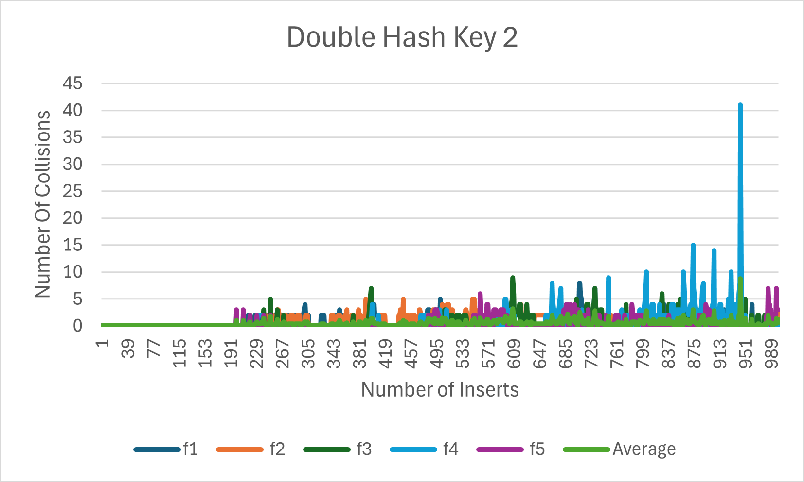
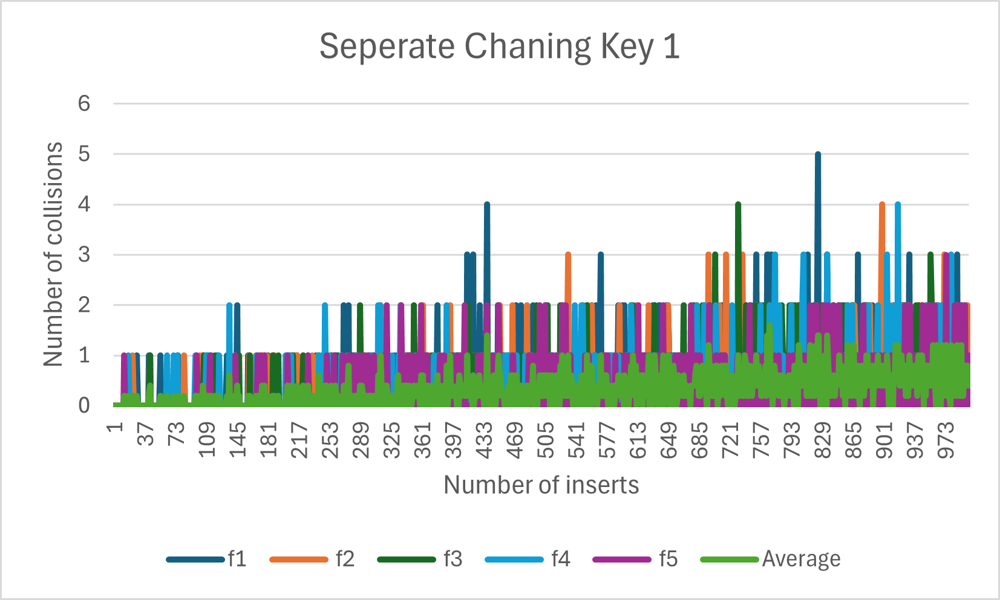
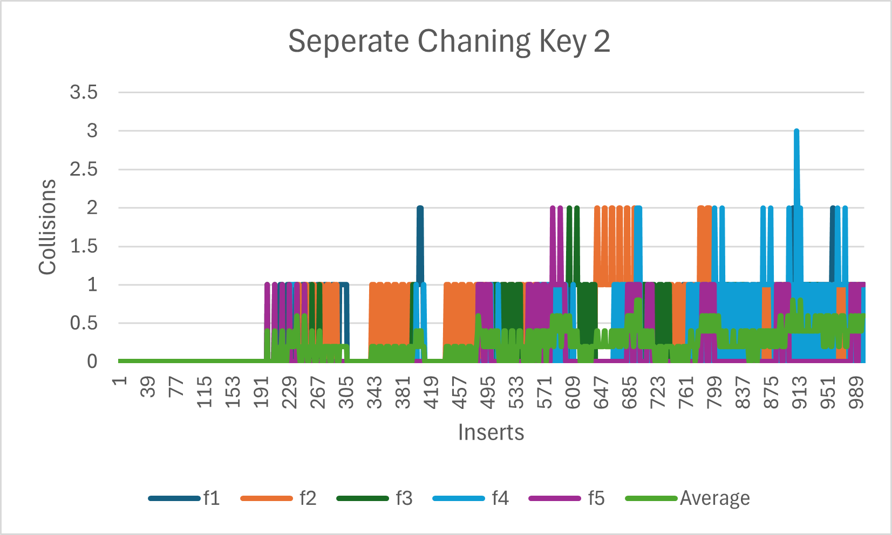

# Project 5 Report Ollie Cloutier

My data set is a collection of pizza orders made in 2015. Each order is given a unique order ID. The data
includes the total price of the order what pizza was ordered, when the order was made, what ingredients went
into the pizza, and other important information.

The collisions for the most part are higher for the smaller tables this makes sense because there's less
space in the smaller tables so the chance for a collision is much more likely. There are some spikes in the
Larger tables after a bunch of inserts and this is likely because the larger tables have started to fill up more
and the smaller tables have rehashed already and become larger than them.

The best function for generating a key appears to be function 1 because it's average number of collisions stays
around 1.5 for the open addressing function while function 2 stays around 2.5. This is probably because function 1
uses two attributes of the Pizza class to make a key while function 2 only uses 1. However, for separate chaining
function 2 beats function 1 making it hard to determine which one is really better.

Separate chaining works better for my dataset its average number of collisions were around 1 for key 1 and 0.5 for key 2 while
open addressing had an average number of collisions around 1.75 for key 1 and 2.5 for key 2. Separate chaining had fewer
collisions overall and was the better collision detection system for my dataset.